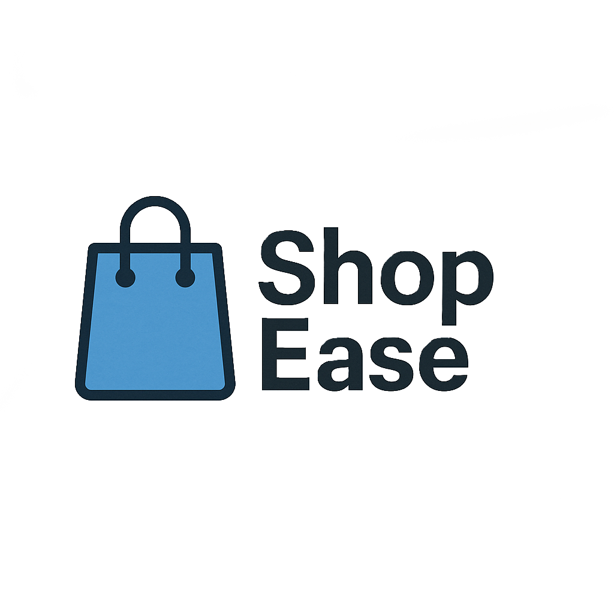

  

 

 # 
<em> **Shopping Behavior Analysis**

## Client Background
**ShopEase** is a U.S.-based retail company specializing in fashion products, including clothing, footwear, and accessories. Established in 2023, the company has quickly gained popularity as a hometown favorite by offering trend-focused merchandise at accessible price points. As customer demand has grown following the company’s expansion to statewide service, ShopEase seeks to better understand purchasing behavior across product categories, seasons, and customer demographics to support data-driven inventory and marketing decisions.

At the moment ShopEase's, book of business is approaching **11,900 customers**, with **20,000 transactions**, and a **sales revenue of approximately 1M**

## Project Stakeholders & Workflow
The analysis followed an iterative **workflow**, beginning with stakeholder alignment on business objectives, followed by exploratory data analysis and validation of findings through periodic stakeholder reviews. Insights were refined based on operational feedback to ensure practical applicability.

Stakeholders: **Operations Manager, Inventory Manager, Marketing and Retail Operations**
## Business Problem
The client lacks clear visibility into:
- Which product categories perform best
- How customer demographics affect spending
- Seasonal purchasing patterns

## Dataset
- Source: Synthetic retail shopping behavior dataset
- Records: ~20,000 customer transactions
- Key variables:
  - Category
  - Gender
  - Season
  - Purchase Amount (USD)

## Tools Used
- Python
- pandas
- matplotlib
- Jupyter Notebook

## Analysis Approach
1. Data loading and inspection
2. Exploration of categorical variables
3. Aggregation and summary statistics
4. Visualization of key trends

## Key Insights
- Certain categories consistently outperform others
- Average purchase amount varies by demographic group
- Seasonal trends suggest opportunities for inventory optimization

## Deliverables
- Jupyter Notebook with full analysis
- Summary tables and visualizations

## Next Steps
- Deeper segmentation analysis
- Predictive modeling for demand forecasting

